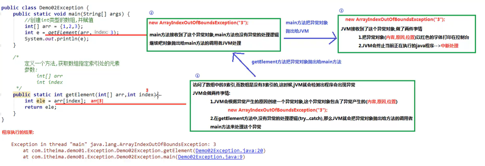

# Java

## java内存分配

1）栈（stack）：存放的都是方法中的局部变量，方法运行一定要在栈当中
		一旦超出作用域，立刻从栈内存中消失

2）堆（heap）：凡是new出来的东西都在堆中（数组也是对象，也放在堆里）
		堆内存中存放的东西（如成员方法，存的是方法区中方法的地址）都有一个地址值：16进制
		堆内存里面的数据（如成员变量）都有默认值，规则：
			整数	0
			浮点数	0.0
			字符	‘\u0000’
			布尔	false
			引用类型	null

3）方法区（method area）：存储.class相关信息，包含方法信息
4）本地方法栈（native method stack）：与操作系统相关
5）寄存器（pc register）：与CPU相关

## 示例过程


对象作为参数传递，实际上传递的是对象的地址


对象作为返回值，返回的还是地址值


## 注意事项

1.局部变量没有默认值，成员变量有
	局部的变量在栈，成员变量在堆
	局部变量随方法进栈被创建，方法出栈而消失。成员变量随对象创建而产生，随对象被垃圾回收而消失


2.对于boolean, Getter方法要写成isXxx形式

```java
	public class student{
		private String name;
		private boolean male;
		
		public void setName(String str){
			name = str;
		}
		public String  getName(){
			return name;
		}
		public boolean isMale{
			return male;
		}
}
```

3.通过谁调用的方法，谁就是this
4.构造方法名必须和所在类名完全一样，且不能写返回值类型，连void都不要写
5.标准类构造：
	（1）所有成员变量使用private修饰
	（2）每一个成员变量都有Getter/Setter方法
	（3）编写一个无参数构造方法和一个全参数构造方法
6.只有java.lang包下的内容不需要导包，其他的包都需要

# Scanner

```java
import java.util.Scanner;
….
	//Sysetm.in代表从键盘输入
	Scanner scn = new Scanner(System.in);
	//获取键盘的输入的一个数字
	int num = scn.nextInt();
	//获取键盘输入的字符串
	Sring str = scn.next();
```

# Random

```java
import java.util.Random;
….
	Random ra = new Random();
	int num = ra.nextInt();
	//范围左闭右开[0,3)
	int range =ra.nextInt(3);
```

# ArrayList

```java
/*
ArrayList集合长度可以随意变化，但是数组长度是固定的
虽然如此，但是ArrayList底层仍是数组
<>中为泛型，指装在集合中所有元素的类型，只能是引用类型，不能是基本类型
对ArrayList集合来说，直接打印得到的不是地址值，而是内容，如果为空，则打印出来的是[]
*/
ArrayList <String> list = new ArrayList<>();
list.add("hello world"); 
//add方法对ArrayList来说是一定会成功的，因此add()方法返回值一定是true，但其他集合的add()方法不一定成功
boolean success = list.add("hello");
//get方法
String str = list.get(1);
//remove方法
String whoremove = list.remove(1);
//大小
list.size();
```

如果想要存放基本数据类型，需要用到包装类（引用类型）

| 基本数据类型 | 包装类    |
| ------------ | --------- |
| byte         | Byte      |
| int          | Integer   |
| short        | Short     |
| long         | Long      |
| float        | Float     |
| double       | Double    |
| char         | Character |
| boolean      | Boolean   |

# String

```java
/*
string类效果是char[ ]字符数组,但底层原理是byte[ ]字节数组
直接双引号赋值的String就在字符串常量池中
基本类型==进行数值比较
引用类型==进行地址值比较
*/
char[ ] ch = {'a','b','c'};
String str1 = new String(ch);

byte[ ] by = {97,98,99};
String str2 = new String(by);

System.out.println(str1 + "\n" + str2);
```


String 类型字符串比较,只有内容完全相同才会返回true：
`str1.equals( str2 );`

推荐：`"abc".equals( str1 );`
不推荐：`str1.equals( "abc" );`
原因：当`str1 = null`时，后者会报空指针错误，而前者不会

忽略大小写比较：
`str1.equalsIgnoreCase( str2 );`

```java
//其他方法：
str.length;		//字符串长度
str3 = str1.concat( str2 );		//返回新的连接字符串(原字符串不变)
str.charAt( 3 );		//字符串第3个位置字符
str1.indexOf( str2 );		//str2 在 str1 中首次出现的索引位置，没有返回-1
str1.substring( 3 );	//截取从3到末尾的子串
str1.substring( 3,5 );		//截取[ 3,5 )的子串
char[ ] str_char = str.toCharArray();	//转换为字符数组类型
byte[] str_bytes =str.getBytes();	//转换为字节数组类型

String str = "hello hello world world";		
String str2 = str.replace("hello", "fuck");		//替换字符串

String str = "aaa,bbb,ccc";	
String[] str2 = str.split(",") ;////按参数分割字符串，返回字符串数组，参数实际上是正则表达式，对于“.”分割的字符，参数为“\\.”

```

# Static

static修饰成员变量，那么这个成员变量就不属于对象，而属于类

static修饰成员方法，那么这个成员方法也不属于对象，而属于类

被static修饰的，不论是成员变量还是成员方法，都推荐使用类名调用，这样区分更清楚

注意：1.静态不能访问非静态，原因是内存中先有静态，后有非静态，先人不知道后人，后人知道先人

​			2.静态方法中不能使用this,原因是this代表当前对象，通过谁调用的方法，谁就是当前对象。


静态代码块

特点：当第一次用到本类时，静态代码块执行唯一的一次

​			静态内容总是优先于非静态内容，因此静态代码块比构造方法先执行

典型用途：

​			用来一次性对静态成员变量赋值

```java
public class 类名{
	static {
		...
	}
}
```

# Arryays

```java
import java.util 
...
int[ ] arr ={1,2,3}
String str = Arrays.toString( arr );	//数组转字符串
Arrays.sort( arr );		//默认升序排列(必须是数组才能使用4)

```

# Math

```java
import java.lang
   ...
	public static double abs(double num);//绝对值
	public static double ceil(double num);//向上取整
	public static double floor(double num);//向下取整
	public static long round(double num);//四舍五入
	//Math.PI代表近似的圆周率常量（double）
```

# 继承

java是单继承的，一个类的直接父类只有一个

成员方法看右侧，new的是谁就是谁的成员方法

在父子类的继承关系中，如果成员变量重名，则创建子类对象时，访问有两种方式：

​	直接通过子类对象访问，等号左边是谁就优先用谁，没有就向上找

​	间接通过成员方法访问，方法属于谁就优先用谁，没有就向上找

```java
public class Fu {
    int num = 30;
    private String name = "马云";
    void show() {
        System.out.println(num);
    }
}

public class Zi extends Fu{
    int num = 20;
}

public class Main {

    public static void main(String[] args) {
        Zi test = new Zi();
        test.show();//输出为Fu的num,30
    }
}
```

```java
public class Zi extends Fu{
    int num = 10;
    public void method(){
        int num = 20;
        sout(num);	//20,局部变量
        sout(this.num);	//10,本类的成员变量
        sout(super.num);	//30，父类的成员变量
    }
}
```

**方法的重写 **

​	重写（override）:方法名称一样，参数列表也一样

​	重载（overload）:方法名称一样，参数列表不一样

​	大部分重写都保持和父类权限和返回值相同

注意：对已经投入使用的类，一般不要修改，推荐定义一个新的类来重复利用共性内容并添加新内容

**继承关系中父子类构造方法的访问特点：**

​	1.子类构造方法中默认隐含`super()`调用，所以一定是先调用父类构造，后执行子类构造

​	2.子类构造可以通过super关键字来调用父类重载构造

​	3.super的父类构造调用，必须是子类构造方法的第一个语句，，一个子类不能多次调用super构造

​	总结：子类必须调用父类构造方法，不写则赠送super(),写了则使用写的，super只能有一个，且必须是第一个

**super关键字用法**

​	1.子类成员方法中访问父类成员变量

​	2.子类成员方法中访问父类成员方法

​	3.子类构造方法中访问父类构造方法

**内存图**

注意：子类method中有一个super.method(); 图中没有写出来


# 抽象方法

抽象方法所在的类必须是抽象类

```java
public  abstract  class  Animal{
	public  abstract  void  eat();
}
```

注意：

​	1.不能直接`new`抽象类对象

​	2.必须用一个子类来继承抽象父类

​	3.子类必须覆盖重写抽象父类所有抽象方法

​	4.创建子类对象进行使用

​	5.抽象类不一定有抽象方法，有抽象方法的一定是抽象类，因为有些情况不想让调用者创建该类对象

​	6.抽象类可以有构造方法，是供子类创建对象，初始化父类成员使用的

# 接口

接口的实现类一般使用Impl结尾作为类名（implement）；

接口中所有方法都是抽象方法，不写abstract也是抽象方法，因为接口会默认自动加上abstract；

接口就是多个类的公共规范

接口是一种引用数据类型，最重要的就是其中的抽象方法

接口编译生成的字节码文件仍是:	.java --> .class

接口中可包含的内容：

​	java7：常量，抽象方法

​	java8：默认方法，静态方法

​	java 9：私有方法

使用步骤：

​	1.接口不能直接使用，必须有一个实现类来实现该接口

​	`public class 实现类名称 implements 接口名称{	}`

​	2.实现类必须覆盖重写接口中所有的抽象方法

​	3.创建实现类对象进行使用

注意：如果实现类没有重写接口中所有抽象方法，那么这个实现类自己必须是抽象类

**默认方法：**
	`public default 方法名（参数列表）{
		方法体
	}`
作用：实现接口的类的对象可以直接调用接口的默认方法（向上找原则）,解决接口升级问题

举例：当一个接口被很多类实现了以后，需要添加新的方法对接口升级，但是直接添加的话会使所有实现这个接口的类报错，因为它们都没有override这个新方法。因此需要默认方法来解决。

**静态方法：**
	public static 方法名（参数列表）{
		方法体
	}
注意：不能通过接口实现类调用静态方法，要通过接口名直接调用；

**私有方法：**
为了解决方法之间重复代码，可以额外写一个方法包含重复代码，供其他方法直接调用。但是这样new出来的对象也能直接使用这个额外方法，因此需要私有方法保证不被外部访问到

​	普通私有方法：
​		private 返回值类型 方法名（参数列表）{
​			方法体
​		}
​	作用：解决多个默认方法之间代码重复的问题

​	静态私有方法：
​		private static 返回值类型 方法名（参数列表）{
​			方法体
​		}
​	作用：解决多个静态方法之间代码重复的问题

**成员变量**

​	必须使用`public static final`修饰，从效果看，其实就是接口的常量

​	注意：

​	1.一旦使用final修饰，说明不可变

​	2.接口中的常量可以省略`public static final`

​	3.接口中的常量必须赋值

​	4.接口中的常量名称，推荐使用完全大写，用下划线分隔

**使用接口时要注意**

 * 接口没有静态代码块或构造方法

 * 一个类只能继承一个父类，但是可以同时实现多个接口

 * 如果实现类实现的多个接口中有重复的**抽象方法**，只需重写一次

 * 如果实现类没有重写所有抽象方法，那么实现类必须是抽象类

 * 如果实现类实现的多个接口中有重复的**默认方法**，那么实现类一定要对冲突的默认方法进行覆盖重写，并且带着**default**关键字

 * 实现类的直接父类方法和接口中的默认方法冲突，优先使用父类的方法

   

# 多态

代码中体现多态性，就是一句话，父类引用指向子类对象 

格式：

​		父类名称 对象名 = new 子类名称（）；

​		接口名称 对象名 = new 实现类名称（）；

在多态中成员方法的访问规则：

​	new的是谁，就优先用谁，没有则向上找

​	口诀：编译看左边，运行看右边

成员变量：编译看左边，运行还看左边

成员方法：编译看左边，运行看右边

```java
public class Fu {
    int num = 30;
    private String name = "马云";
    void show() {
        System.out.println(num);
    }
}

public class Zi extends Fu{
    int num = 20;
    public void show(){
        System.out.println(num);
    }
}

public class Main {

    public static void main(String[] args) {
        Fu test = new Zi();
        sout(test.num);//编译看左边，运行还看左边。输出为Fu的num,30
        test.show();//编译看左边，运行看右边。调用的是Zi的show()方法
        
    }
}
```

**多态的好处**

```java
//不用多态
Teacher one = new Teacher();
one.work();//讲课
Assistant two = new Assistant();
two.work();//辅导

//使用多态
Employee one = new Teacher();
one.work();//讲课
Employee two = new Teacher();
two.work();//讲课
```

传参时不需要判断是哪种类型了，直接使用多态调用方法就行了

```java
public void method(Employee e){
    e.work();
}
```


**多态的弊端**

​	无法使用子类特有的内容

​	解决方法：向下转型

# 向上转型与向下转型

* 对象的向上转型，其实就是多态

  父类名称 对象名 = new 子类名称（）；

  向上转型一定是安全的

* 对象的向下转型，其实是一个还原动作

  子类名称 对象名 = （子类名称） 父类对象；

  注意：必须保证对象本来创建的就是猫，才能向下转型为猫

* 如何知道一个父类的引用对象本来是什么子类？

  对象 instanceof 类名称

  会得到一个boolean值结果

# final修饰符

* final修饰类：此类不能被子类继承（太监类）
* final修饰方法：此方法不能被覆盖重写
* 对于类和方法来说，final和abstract不能同时使用，因为final不能重写，而abstract必须重写，矛盾

* final修饰局部变量：

  ​	基本类型：只能唯一一次赋值，数据不可变

  ​	引用类型：地址值不可变，地址存放的内容可变

* final修饰成员变量：

  ​	成员变量有默认值，用了final修饰后不再拥有默认值，必须手动赋值

  ​	要么直接赋值，要么构造方法赋值

* 必须保证类当中所有重载的构造方法都最终会对final的成员变量赋值

# 四种权限修饰符

|              | public | protected | (default) | private |
| ------------ | ------ | --------- | --------- | ------- |
| 同一个类     | YES    | YES       | YES       | YES     |
| 同一个包     | YES    | YES       | YES       | NO      |
| 不同包子类   | YES    | YES       | NO        | NO      |
| 不同包非子类 | YES    | NO        | NO        | NO      |

注意：default不是关键字“default”,而是根本不写

# 内部类

* 成员内部类

  ```java
  public class Outter {
      int num = 10;
      public class Inner{
          int num = 20;
          public void methodInner(){
              int num = 30;
              System.out.println(num);//30
              System.out.println(this.num);//20
              System.out.println(Outter.this.num);//10
          }
      }
  }
  ```

* 局部内部类

  ​	方法中定义的内部类，出了此方法都不能用

  ​	如果希望访问所在方法的局部变量，那么这个局部变量必须是**有效final的**（从java8开始可以省略）

  ​	原因：

  ​		1.new出来的对象在堆内存中

  ​		2.局部变量跟着方法走，在栈内存中

  ​		3.方法运行结束后，立刻出栈，局部变量立刻消失

  ​		4.但是new出来的对象会在堆当中持续存在，直到垃圾回收消失

  ​		注：当方法执行结束后，局部变量从栈中消失，方法中new的对象使用的是局部变量的copy，在常量池中，但要保证局部变量不能变来变去

  

  * 匿名内部类
    	如果接口的实现类只需要实现唯一的一次，那么可以**省略该接口的实现类的定义**，而使用匿名内部类
    	格式：
    		接口名称 对象名 = new 接口名称（）{
    			覆盖重写所有抽象方法
    		}；
    	形态1（匿名内部类）：
    		`MyInterface objA = new MyInterface() {method1(){ 方法实现 } };
    		objA.method1;`
    	形态2（既是匿名内部类，也是匿名对象）：
    		`new MyInterface(){ method1(){ 方法实现 } }.method1();`
    匿名内部类省略了类/子类名称，匿名对象省略了对象名称，二者不是一回事！！！

  ​	

* 修饰符：

  ​	外部类：public / default

  ​	成员内部类：public / protected / default / private

  ​	局部内部类：什么都不能写

# 接口作为成员变量

```java
class A{
	private MyInterface obj;
	public void setMyInterface(MyInterface in){//对象调用此方法时传入的是接口的实现类
		obj = in;
	}
}
```


# object类中的方法

object类是所有类的根类，因此所有类都能使用object类的方法

* toString方法

  `String str="hellworld";
  System.out.println(str);`
  输出语句默认调用的就是toString方法

  默认输出的是地址值，没有意义，最好重写输出属性值

  看一个类是否重写了toString方法，直接打印这个类对应的对象名字即可

* equals方法

  默认比较的是地址值，没有意义，最好重写比较属性值
  `Person p1 = new Person("张三")；
  Person p2 = new Person("李四")；
  boolean res = p1.equals(p2);`
  注：引用类型比较的是地址值
  怎样重写equals()方法？
  **alt+insert**
  重写equals方法的要求：
  1、自反性：对于任何非空引用x，x.equals(x)应该返回true。
  2、对称性：对于任何引用x和y，如果x.equals(y)返回true，那么y.equals(x)也应该返回true。
  3、传递性：对于任何引用x、y和z，如果x.equals(y)返回true，y.equals(z)返回true，那么x.equals(z)也应该返回true。
  4、一致性：如果x和y引用的对象没有发生变化，那么反复调用x.equals(y)应该返回同样的结果。
  5、非空性：对于任意非空引用x，x.equals(null)应该返回false

  **Object.equals(p1,p2)   //可以防止 p1.equals(p2) 可能的空指针异常**

# Date类

* Date 类表示特定瞬间，精确到毫秒
  如：2021-7-7 15:28:33:333
  时间原点：1970年1月1日 00:00:00（英国格林威治）
  中国属于东八区，需要加8个小时
  时间原点：1970年1月1日 08:00:00（中国）

```java
System.out.println(System.currentTimeMillis());//时间原点到当前时间的毫秒间隔1625124936537
System.out.println(new Date().getTime());//等同于System.currentTimeMillis()
System.out.println(new Date());//返回当前日期Thu Jul 01 15:35:36 CST2021
/*
Date带参构造方法：
Date(longdate):传递毫秒值，将毫秒值转化为Date日期
*/
System.out.println(new Date(1625124936537L));//Thu Jul 01 15:35:36 CST2021
```

* DateFormat类
  DateFormat是一个抽象类
  作用：格式化 日期->文本 
  	  解析    文本->日期
  	  标准化
  使用时需要使用其实现子类：SimpleDateFormat

  1.format()方法：日期->文本

  ```java
  /*
  y年 M月 d日 H时 m分 s秒
  步骤：
  	1.创建SimpleDateFormat对象
  	2.调用方法
  */
  Date date =newDate();
  SimpleDateFormat sd f= newSimpleDateFormat("yyyy-MM-ddHH:mm:ss");
  String s = sdf.format(date);
  System.out.println(s);//2021-07-0116:30:36
  System.out.println(date);//ThuJul0116:30:36CST2021
  ```

  2.parse()方法：文本->日期

  ```java
  /*
  使用步骤：
  	1.创建SimpleDateFormat对象，构造方法中传递指定的模式
  	2.调用SimpleDateFormat对象中的parse(),把符合构造方法中模式的字符串，解析为Date日期
  注意：
  	public Date parse(String source) throws ParseExcetion
  	parse方法声明了一个异常叫ParseException解析异常
  	如果字符串和构造方法中的模式不一样，那么程序就会抛出此异常
  	调用一个抛出了异常的方法，就必须处理这个异常，要么throws继续上给你们抛出这个异常，要么try...catch自己		处理这个异常
  	处理方法：alt+回车
  */
  
  public class Date1 {
      public static void main(String[] args) throws ParseException {
          Scanner sc = new Scanner(System.in);
          System.out.println("请输入出生日期,格式为yyyy-MM-dd");
          String str = sc.next();
          SimpleDateFormat format = new SimpleDateFormat("yyyy-MM-dd");
          Date bir = format.parse(str);
          long time = bir.getTime();
          long now = new Date().getTime();
          long days = (now - time)/1000/60/60/24;
          System.out.println("出生天数为："+days);
      }
  }
  ```

# Calender类

* 抽象类
  `java.util.Calendar`
* 不用子类创建对象，使用`getInstance( )`方法，返回calender类的子类对象
  `Canlender now = Calender.gerInstance( ); `  //多态

```java
Calendar now = Calendar.getInstance();
System.out.println(now);

//get()方法返回给定日历字段的值
int year=now.get(Calendar.YEAR);
int month=now.get(Calendar.MONTH);
int day=now.get(Calendar.DATE);
int days=now.get(Calendar.DAY_OF_MONTH);//和Calendar.DATE效果相同
System.out.println(year+"\t"+month+"\t"+days);

//set()单独设置将给定的日历字段设置为给定值
now.set(Calendar.YEAR,1995);
now.set(Calendar.MONTH,12);
now.set(Calendar.DATE,6);
//set()同时设置
now.set(1995,12,6);

//add()方法为给定的日历字段添加给定的时间量
now.add(Calendar.YEAR,2);//正数增加
now.add(Calendar.YEAR,-2);//负数减少

//getTime()方法把日历对象转换为日期对象
Calendarc=Calendar.getInstance();
Datedate=now.getTime();
System.out.println(date);
```

# System类

1.与Date.getTime()作用相同，返回1970.1.1 8:00:00至今的毫秒值

```java
System.currentTimeMillis()
```


2.

```java
/*
arraycopy(Object src , int srcPos , Object dest , int destPos , int length )
原数组，原数组索引起始位置，目标数组，目标数组索引起始位置，复制元素个数
会覆盖目标数组的原数值

静态方法 可通过类名System直接调用
*/
int[] src={1,2,3,4,5,6};
int[] dest={7,8,9,10,11,12};

System.out.println(Arrays.toString(dest));
System.arraycopy(src,0,dest,0,3);
System.out.println(Arrays.toString(dest));

```

# StringBuilder类

* String类
  	底层是一个被final修饰的字符数组
  	`private final byte[] value`
  	字符串是常量，在创建后不能更改
  	字符串相加会有多个字符串，占用空间多：
  	`String str = "a" + "b" + "c"`
  		此时内存中有 ：`"a" , "b", "c", "ab", "abc"`共5个字符串
* StringBulider类
  	底层是一个没有被final修饰的字符数组（初始大小为16）
  	`byte[ ] value = new byte[16]
  	String str = "a" + "b" + "c"`
  		此时内存只有一个字符串“abc”
  	StringBuilder在内存中始终是一个数组，占用空间少，效率高，会自动扩容
  	
  	

* 构造方法：
  （1）空参数，构造一个空的StringBulider容器
  	`StringBulider sbl = new StringBulider( )`
  （2）带参数，构造一个StringBulider容器，并将字符串添加进去
  	`StringBulider sbl = new StringBulider( “hello”)`

* 常用方法：
  `bu1.append("world");`

  ​	append（）方法返回值是当前对象自身，即会改变字符串本身

  `bu1.reverse( ) `反转内容

  

  string->stringbulider

  ​	`StringBulider(String str)`

  ​	`stringbulider->string`

  bu1.toString( ) 将缓冲区内容转为字符串

# 包装类

* 作用

  ​	基本数据类型没有对应方法来操作这些数据，因此我们可以使用一个类，把基本数据类型的数据包装起来，这个类

  叫做包装类，在包装类中可以定义一些方法来操作基本数据类型

* 装箱
  	（1）构造方法（过时了）：

  ​		` Integer in = new Integer( 1 );`

  ​		`Integer in2 = new Integer( "1" ); `//字符串也行，但是字符串表示的必须是基本数据类型

  ​	（2）静态方法：

  ​		`Integer in = Integer.valueOf( 1 );`

  ​		`Integer in2 = Integer.valueOf( “1” );`

* 拆箱
  `int in = int2.intValue( );`

* 自动装箱（JDK1.5以后）
  `Integer in = 1;  `//相当于Integer in = new Integer(1);
  * 自动拆箱
    	`in = in +2;`
    	（1）int + 2  相当于 `in.intValue( ) + 2 =3`
    	（2）in = in + 2 相当于` in = new Integer( 3 );`
    	应用：
    	`ArrayList<Integer> list = new ArrayList( );`
    	`list.add( 1 );  `//自动装箱 `list.add(new Integer( 1 ) )`
    	`list.get( 0 );  ` //自动拆箱`list.get( 0 ).intValue( );`

# 基本数据类型与字符串之间的转换

* 基本数据类型（4类8种）
  	`byte short int long float double char boolean`
  	转字符串三种方式：
  	（1）123+“”;
  	（2）先转为包装类，再使用toSring( )方法
  			Integer i = 123；
  			String s = i.toString( );
  	（3）String.valueOf( );
* 字符串转基本数据类型
  	利用包装类的pase方法：
  	`int i = Integer.paseInt("100")
  	float j = Float.paseFloat("100")`
  	
  注意：Character类没有对应的pase方法，只有另外7类有

# Collection集合

## 单列集合体系结构


## 常用方法

| boolean add(E e)      | 向集合中添加元素         |
| --------------------- | ------------------------ |
| boolean remove(E e)   | 删除集合中某个元素       |
| void clear( );        | 清空所有元素             |
| boolean contains(E e) | 判断集合是否包含某个元素 |
| boolean isEmpty( )    | 判断是否为空             |
| int size()            | 获取集合长度             |
| Object[ ] toArray( )  | 将集合转为数组           |

```java
Collection<String> col = new HashSet<>();
col.add("hello");
col.add("world");
String[] str = newString[2];
col.toArray(str);
或
Collection<String> col = new HashSet<>();
col.add("hello");
col.add("world");
Object[ ] str = col.toArray( );
```

# Iterator迭代器

java.util.Iterator

Iterator迭代器是一个接口，无法直接使用，需要使用该接口的实现类对象

* 迭代器是通用的取出集合中元素的方法，不管有没有索引
  	（1）判断有没有元素
  	（2）有则取出元素，回到（1）
  	（3）没有就结束
  这种取出方式专业术语为迭代

* 方法

  | boolean | hasNext() | 如果仍有元素可以迭代，返回true                               |
  | ------- | --------- | ------------------------------------------------------------ |
  |         | next()    | 返回迭代的下一个元素，即取出元素，也将指针后移一位           |
  | void    | remove()  | 从迭代器指向的collection中移除迭代器返回的最后一个元素（不常用） |

* 使用

  实现方法：

  ​	Collection接口中有个iterator( )方法，返回的就是在当前collection元素上迭代的迭代器

  ​	迭代器的使用步骤：

  ​		（1）使用集合中的iterator( )方法获取迭代器的实现类对象，使用Iterator接口接收（多态，注意Iterator也是有泛

  型的，与集合泛型一致）
  		（2）使用Iterator接口中的方法hasNext（）判断还有没有下一个元素

  ​		（3）使用Iterator接口中的方法next( )取出集合下一个元素

  ```java
  	Collection<String> col = new ArrayDeque<>();
  	col.add("hello");
  	col.add("world");
  	Iterator<String> ite = col.iterator();
  	while(ite.hasNext()){
  		System.out.println(ite.next());
  }
  ```

  

* 原理

  

#  增强for循环

也叫for each循环，是JDK1.5以后专门用来遍历**数组和集合**的，内部实现原理是个`Iterator`迭代器，所以在遍历过程中不能对集合中的元素进行增删操作

```java
Collection<String> col = new ArrayDeque<>();
col.add("hello");
col.add("world");
for(String i : col){
    System.out.println(i);
}
```

# 泛型

泛型是一种未知的数据类型，当我们不知道用什么数据类型的时候，可以使用泛型

E	e	:	Element	元素

T	t	:	Type	类型

## 泛型类


```java
public class ArrayList<E>{
    public boolean add(E e){}
    public E get(int index){}
}
```

不写泛型的话默认object类型，可以储存任意类型数据

缺点：不安全，会引发异常

```java
//使用泛型

ArrayList<String> list = new ArrayList<>();
//不使用泛型
ArrayList list = new ArrayList();
```

```java
//定义含有泛型的类
public class Genetic<E> {
    private E name;

    public void setName(E name) {
        this.name = name;
    }

    public E getName() {
        return name;
    }
}
```

```java
//定义含有泛型的方法
public <E> void method01(E e){}
public static <M> void method02(M m){}
```

## 泛型接口

```java
/*定义含有泛型的接口
	第一种：接口实现类确定泛型
	第二种：接口实现类依然使用接口泛型，创建对象时确定泛型
*/
	
public interface Generic<E>{
    public abstract void method(E e);
}
//第一种
public class  GenericImpl01 implements Generic<String>{
    @Override
    public void method(String s){
        sout(s);
    }
}

GenericImpl01 gi1 = new GenericImpl01();
//第二种
public class GenericImpl02<E> implements Generic<E>{
    @Override
    public void method(String s){
        sout(s);
    }
}
GenericImpl02<String> gi2 = new GenericImpl02<>();
GeneticImpl03<Integer> gi3 = new GenericImpl03<>();
```


## 泛型通配符

<?>	:	代表任意的数据类型

使用方法：

​				不能创建对象使用

​				只能作为方法参数使用

注意：泛型没有继承概念，如果形参为Object泛型，那么实参必须为Object泛型

```java
//例：输出所有ArrayList集合中的数据
    public static void pr(ArrayList<?> list){	//此处若为Object泛型，则传入的必须都为Object泛型，因此说泛型没有继承概念
        Iterator<?> it = list.iterator();
        while(it.hasNext()){
            System.out.println(it.next());
        }
    }

    public static void main(String[] args) {
        ArrayList<String> list = new ArrayList<>();
        ArrayList<String> list1 = new ArrayList();
        list1.add("hello");
        list1.add("world");
        ArrayList<Integer> list2 = new ArrayList<>();
        list2.add(1);
        list2.add(2);
        ArrayList<Boolean> list3 = new ArrayList<>();
        list3.add(true);
        list3.add(false);

        pr(list1);
        pr(list2);
        pr(list3);
    }
```

## 通配符高级使用——受限通配符

（看懂就行，平时用不到）

* 泛型的上限：

  <? extends E>	:	使用的泛型只能是E类型自身或其子类

  <? super E>		:	使用泛型只能是E类型自身或其父类

# 扑克牌案例

```java
//有牌，洗牌，发牌，看牌

public class pokers {
    public static void main(String[] args) {
        ArrayList<String> poker = new ArrayList<>();
        String[] shapes = {"♠","♥","♣","♦"};
        String[] numbers = {"2","A","K","Q","J","10","9","8","7","6","5","4","3"};

        poker.add("king");
        poker.add("queen");

        ArrayList<String> p1 = new ArrayList<>();
        ArrayList<String> p2 = new ArrayList<>();
        ArrayList<String> p3 = new ArrayList<>();
        ArrayList<String> di = new ArrayList<>();

        for (String shape : shapes) {
            for (String number : numbers) {
                poker.add(shape+number);
            }
        }

        Collections.shuffle(poker);//Collections的静态方法，随机打乱顺序
        int index = 0;
        for (String s : poker) {
            if(index>50){
                di.add(s);
            }
            if(index%3 == 0){
                p1.add(s);
            }else if(index % 3 == 1){
                p2.add(s);
            }else if(index % 3 == 2){
                p3.add(s);
            }
            index++;
        }
        System.out.println(p1);
        System.out.println(p2);
        System.out.println(p3);
        System.out.println(di);

    }
}
```

# List集合

特点：

​		1.有序

​		2.允许重复元素

​		3.有索引

特有方法：

```java
public void add(int index,E element);//指定位置添加元素
public E get(int index);//获取指定位置元素
public E remove(int index);//删除指定位置元素
public E set(int index,E element);//替换指定位置元素

```

注意：操作索引时一定要注意索引越界

## ArrayList

List的数组实现，底层为数组，查询快，增删慢

不是同步的，即是多线程的，速度快

遍历方法：

​	1.普通```for```循环，注意获取第```i```个元素是```get(i)```而不是```array[i]```

​	2.迭代器

​	3.增强```for```循环

## LinkedList

List的链表实现，底层为双向链表，查询慢，增删快

不是同步的，即是多线程的，速度快

```java
/*
特有的一些方法
*/
public void addFirst(E e);//插入开头
public void addLast(E e);//插入结尾
public void push(E e);//插入开头

public E getFirst();
public E getLast();

public E removeFirst();
public E removeLast();
public E pop();//相当于removeFirst

public boolean isEmpty();
```

## Vector

List的数组实现，底层为数组

是同步的，即是单线程的，速度慢

被ArrayList取代

# Set集合

不包含重复元素

没有索引，不能使用普通`for`循环遍历

## HashSet

底层为哈希表，查询速度非常快

无序，无索引，不允许存储重复元素

**哈希表**

`java.lang`包中的`Object`类中方法：`int hashCode()`返回对象的哈希码值

哈希表 = 数组 + 链表 / 红黑树（当相同哈希值后的链表超过8位，就会把链表转为红黑树，用来提高查询速度）

Set集合在调用`add（）`方法时，会调用元素的`hashCode()`方法和`epuals()`方法判断元素是否重复

**HashSet存储自定义数据类型**

需要重写对象中的hashCode方法和equals方法，建立自己的比较方式，才能保障HashSet集合中的对象唯一

## LinkedHashSet

`java.util.LinkedHashSet`

`LinkedHashSet extends HashSet`

LinkedHashSet集合特点：

​	底层是一个哈希表（数组+链表/红黑树）+链表：多了一条链表记录元素的存储顺序，保证元素有序

# 可变参数

```java
/*
可变参数是JDK1.5后的新特性
使用前提：
	当方法的参数列表的数据类型已经确定，参数个数不确定时，可以使用可变参数
原理：
	可变参数底层是一个数组，根据传入参数个数的不同，会创建长度不同的数组来存储。参数个数可以是0，1，2...多个
注意事项：
	1.一个方法的参数列表，只能有一个可变参数
	2.可变参数只能放在参数列表末尾
*/
public static void main(String[] args) {
        int res = method1(1,2,3,4,5);
        System.out.println(res);
 }

private static int method1(int ... arr) {
        int sum = 0;
        for (int i : arr) {
            sum += i;
        }
        return sum;
}

//可变参数的特殊（终极）写法：可传入任意类型参数
private static int method1(Object ... obj) 
```

# Collections——操作集合的工具类

`java.util.Collections`是集合工具类，对集合进行操作

`public static <T> boolean addAll(Collection<T> c,T...elementes)`往集合中添加多个元素

`public static void shuffle(List<?> list)`打乱顺序

`public static <T> void sort(List<T> list)`按照默认规则（升序）排序

`public static <T> void sort(List<T> list，Comparator<? super T>)`将集合中元素按照指定规则排序

```java
        ArrayList<String> list = new ArrayList<>();
        Collections.addAll(list,"a","b","c","d","e");
        System.out.println(list);//[a, b, c, d, e]
        Collections.shuffle(list);
        System.out.println(list);//[c, b, a, d, e]
        Collections.sort(list);
        System.out.println(list);//[a, b, c, d, e]
```


**sort方法使用前提：**

​	被排序的集合里面存储的元素，必须实现`Comparable`接口,并重写接口中的方法`compareTo`,定义排序的规则。

```java
/*
Person类，实现Comparable接口，并重写compareTo
*/

public class Person  implements Comparable<Person>{
    private int age;
    private String name;

    public Person() {
    }

    public Person(int age, String name) {
        this.age = age;
        this.name = name;
    }

    @Override
    public String toString() {
        return "Person{" +
                "age=" + age +
                ", name='" + name + '\'' +
                '}';
    }

    public int getAge() {
        return age;
    }

    public void setAge(int age) {
        this.age = age;
    }

    public String getName() {
        return name;
    }

    public void setName(String name) {
        this.name = name;
    }
/*
实现排序规则
	this - 参数 ：实现升序
	参数 - this ：实现降序
*/
    @Override
    public int compareTo(Person o) {

        return this.getAge() - o.getAge();
    }
}

//实现排序
import java.util.ArrayList;
import java.util.Collections;

public class Person_cmp {
    public static void main(String[] args) {
        ArrayList<Person> per = new ArrayList<>();
        per.add(new Person(18,"A"));
        per.add(new Person(17,"b"));
        per.add(new Person(16,"C"));
        System.out.println(per);//[Person{age=18, name='A'}, Person{age=17, name='b'}, Person{age=16, name='C'}]
        Collections.sort(per);
        System.out.println(per);//[Person{age=16, name='C'}, Person{age=17, name='b'}, Person{age=18, name='A'}]
    }
}
```

Comparator与Comparable两者都是接口类型，区别在于：

​	Comparable：自己（this)和别人(参数)比较，自己需要实现Comparable接口，重写compareTo方法

​	Comparator：相当于找一个第三方的裁判，比较两个

```java
/*
不需要实现Comparable接口和重写compareTo方法，使用Comparator的匿名内部类实现排序规则
*/
Collections.sort(per, new Comparator<Person>() {
            @Override
            public int compare(Person o1, Person o2) {
                return o1.getAge() - o2.getAge();
            }
        });
```

# Map集合

Map集合和之前的Collection集合完全是两套体系，Collection集合是**单列集合**，Map集合是**双列集合**

Collection集合中，元素是孤立的，Map集合中，元素是成对存在的，通过键可以找对应的值

注意：1.Map中的集合不能包含重复的键，值可以重复

​			2.Map中每个键只能对应一个值

## Map集合的常用子类

### HashMap<k,v>

`java.util.HashMap<k,v>`集合 `implements Map<k,v>`接口

特点：

​	1.HashMap集合底层是哈希表，查询速度特别快

​		JDK1.8之前：数组+单向链表

​		JDK1.8之后：数组+单向链表/红黑树（链表长度超过8），提高查询速度

​	2.HashMap集合是一个无序集合，存储元素和取出元素顺序可能不一样

### LinkedHashMap<k,v>

​	`java.util.LinkedHashMap<k,v>`集合 `extends HashMap<k,v>`集合

​	特点：

​		1.LinkedHashMap集合底层是哈希表+链表（保证迭代顺序）

​		2.LinkedHashMap集合是一个有序的集合，存储元素和取出元素顺序是一样的

### Hashtabel

HashMap集合可以存储null值，null键

Hashtabel集合不能存储null值，null键

底层是哈希表，单线程集合，速度慢

被HashMap取代

但是其子类：Properties依然被广泛使用

Properties集合是唯一一个和*IO*流相结合的集合

## Map接口常用方法

`public V put(K key,V value)`:返回值类型为V，如果key值集合中没有，返回的V为null，如果有，则替换key对应的value值，返回被替换的value值

`public V get(Object key)`:返回key对应的value值,不存在返回null

`public V remove(Object key)`:删除键值对，无则返回null

`public boolean containValue(Object key)`:如果包含指定键的映射，返回true

```java
HashMap<String,Integer> map = new HashMap<>();
map.put("a",98);
map.put("b",98);
System.out.println(map);//{a=98, b=98}
Integer a = map.remove("b");//注意此处不能使用int，否则报空指针异常，因为int无法接收null,需要用到包装类
System.out.println(map);//{a=98}
Integer b = map.get("b");
System.out.println(b);//null
boolean cot = map.containsKey("a");
System.out.println(cot);//true
```


### Map集合第一种遍历方式

通过键找值的方式

Map集合中的方法：

* `public Set<K> keySet()`	返回此映射中**包含的键**的Set视图

实现步骤：

​	1.使用Map集合中的方法keySet(),把Map集合所有的key取出，存储到一个Set集合中

​	2.遍历set集合，获取Map集合中的每一个key

​	3.通过Map集合中的方法get(key)，通过key找到value

```java
    public static void main(String[] args) {
        HashMap<String,Integer> map = new HashMap<>();
        map.put("a",97);
        map.put("b",98);
        map.put("c",99);
        Set<String> set = map.keySet();//利用keySet()获取key
        for (String s : set) {
            Integer value = map.get(s);
            System.out.println(s+"="+value);
        }

    }
}
```

### Entry键值对对象

Entry将键值对的对应关系封装成了对象，即键值对对象。

Entry同样提供了获取对应键和对应值的方法

​	`public K getKey()`:获取Entry对象中的键

​	`public V getValue()`:获取Entry对象中的值

Map集合中也提供了获取所有Entry对象的方法：

* `public Set<Map.Entry<K,V>> entrySet()`:获取到Map集合中所有的键值对对象的集合（Set集合）

### Map集合遍历的第二种方式

使用Entry对象遍历

Map集合中的方法：

​	`Set<Map.Entry<K,V>> entrySet()`	返回此映射中包含的映射关系的Set视图

实现步骤：

​	1.使用Map集合中的方法`entrySet(),`把Map集合中多个Entry对象取出来，存储到一个Set集合中

​	2.遍历Set集合，获取每一个Entry对象

​	3.使用Entry对象中的方法`getKey()`和`getValue()`获取键与值

```java
    public static void main(String[] args) {
        HashMap<String,Integer> map = new HashMap<>();
        map.put("a",97);
        map.put("b",98);
        map.put("c",99);
        Set<Map.Entry<String,Integer>> set = map.entrySet();//Map.Entry<K,V>是通过 外部类.内部类名 方式访问的Entry对象
        //迭代器
        Iterator<Map.Entry<String,Integer>> it = set.iterator();
        while(it.hasNext()){
            Map.Entry<String,Integer> s = it.next();
            System.out.println(s.getKey()+"="+s.getValue());
        }
        //增强for都可以
        for (Map.Entry<String, Integer> s : set) {
            String str = s.getKey();
            Integer i = s.getValue();
            System.out.println(str+"="+i);
        }

    }
```

## HashMap存储自定义类型键值

Map集合保证**key**值是唯一的，作为key的元素，必须**重写hashCode方法和equals方法**，以保证key值唯一

## HashMap实现统计字符串中字符个数

```java
//用HashMap中key不能重复的特性    
public static void main(String[] args) {
        Scanner sc = new Scanner(System.in);
        System.out.println("输入字符串");
        String str = sc.next();//aaabbbcca
        HashMap<Character,Integer> map = new HashMap<>();

        for (char c : str.toCharArray()) {
            if(map.containsKey(c)){
                Integer value = map.get(c);
                value++;
                map.put(c,value);
            }else{
                map.put(c,1);
            }
        }
        System.out.println(map);//{a=4, b=3, c=2}

    }
```

# JDK9对集合添加的优化

JDK9添加了集中集合工厂方法，更方便创建少量元素的集合、map实例。新的List、Set、Map的**静态**工厂方法可以更方便的创建集合的不可变实例

List接口，Set接口，Map接口：增加了一个静态方法of,可以给集合一次性添加多个元素

使用前提：

​	当集合中存储的元素的个数已经确定了，不再改变时使用

注意：

​	1.of方法只适用于List接口，Set接口，Map接口，**不适用于接口的实现类**

​	2.of方法的返回值是一个不能改变的集合，集合不能再使用add,put方法添加元素，会抛出异常

​	3.Set接口和Map接口在调用of方法时，不能有重复的元素，否则会抛出异常

```java
    public static void main(String[] args) {
        List<Integer> in = List.of(1, 2, 3,4,5,6,7);
        Set<String> s = Set.of("a","b","c");
        Map<Character,Integer> m = Map.of('a',1,'b',2,'c',3);

    }
```

# 有序的扑克牌案例

```java
import java.util.*;

public class Order_Poker {
    public static void main(String[] args) {
        List<String> shape = List.of("♥","♣","♠","♦");
        List<String> numbers = List.of("2","A","K","Q","J","10","9","8","7","6","5","4","3");
        HashMap<Integer,String> pokers = new HashMap<>();
        ArrayList<Integer> index_arr = new ArrayList<>();
        //生成牌
        Integer index = 0;
        pokers.put(index,"keen");
        index++;
        pokers.put(index,"queen");
        index++;
        for (String number : numbers) {
            for (String s : shape) {
                String poker = s+number;
                pokers.put(index,poker);
                index++;
            }
        }
        for(int i=0;i<=53;i++){
            index_arr.add(i);
        }
        //发牌
        ArrayList<Integer> p1 = new ArrayList<>();
        ArrayList<Integer> p2 = new ArrayList<>();
        ArrayList<Integer> p3 = new ArrayList<>();
        ArrayList<Integer> dipai = new ArrayList<>();
        Collections.shuffle(index_arr);

        for (int i = 0;i<index_arr.size();i++) {
            Integer temp = index_arr.get(i);
            if(i>50){
                dipai.add(temp);
            }else if(i % 3 == 0)
            {
                p1.add(temp);
            }else if(i % 3 == 1)
            {
                p2.add(temp);
            }else if(i % 3 == 2)
            {
                p3.add(temp);
            }
        }
        //看牌
        saw("player1",pokers,p1);
        saw("player2",pokers,p2);
        saw("player3",pokers,p3);
        saw("dipai",pokers,dipai);
    }
    public static void saw(String name,HashMap<Integer,String> map,ArrayList<Integer> arr){
        System.out.print(name+":");
        Collections.sort(arr);
        ArrayList<String> res = new ArrayList<>();
        for (Integer integer : arr) {
            res.add(map.get(integer));
        }
        System.out.println(res);
    }
}

```

# 异常

## 概述

在java等面向对象的编程语言中，异常本身是一个类，产生异常就是创建异常对象并抛出了一个异常对象，java处理异常的方式是中断处理

 异常的根类是`java.lang.Throwable`，其下有两个子类，`java.lang.Error`和`java.lang.Exception`,平时所说的异常指`java.lang.Exception`

* Error：工程师不能解决，只能尽量避免（绝症，必须修改源代码程序才能执行）

  ```java
  //OutOfMemoryError,内存溢出错误，创建的数组太大，超出了给JVM分配的内存，只能修改源代码
  int[] arr = new int[1024*1024*1024];
  ```

  

* Exception：编译期异常，由于使用不当导致，可以避免

  ​	RuntimeException：运行期异常（小病），是Exception下的一个子类，把异常处理后程序可以继续执行

```java
SimpleDateFormat format = new SimpleDateFormat("yyyy-MM-dd");
Date bir = format.parse(str);//此处的parse方法就需要处理异常
//第一种处理方法，将异常抛出给虚拟机处理，虚拟机中止程序并打印异常
public static void main(String[] args) throws ParseException 
//第二种处理方法，try...catch,程序会继续运行之后的代码，结束后打印异常
try {
    //可能会出现异常的代码
     bir = format.parse(str);
} catch (ParseException e) {
    //异常的处理逻辑
     e.printStackTrace();
}
```

## 异常处理过程分析



异常处理5个关键字：**try,catch,finally,throw,throws**

## throw关键字

作用：在指定方法中抛出指定异常

格式：`throw new xxxException("异常产生的原因")`

注意：

​	1.throw关键字必须写在方法内部

​	2.throw关键字后的new的对象必须是Exception或者Exception的子类对象

​	3.throw关键字抛出指定的异常对象，我们就必须处理这个异常对象

​		throw关键字后创建的是`RuntimeException`或者是`RuntimeException`的子类对象，可以不处理(比如		`NullPointerException`,`ArrayIndexOutOfBoundsException`)，交给JVM处理（打印异常，中断程序）

​		throw关键字后边创建的是编译异常（写代码的时候报错），我们就必须处理这个异常，要么throws，要么try...catch

​	实际工作中，我们首先必须对方法传递过来的参数进行合法性校验，如果参数不合法，就必须使用抛出异常的方式，告知方法的调用者，传递的参数有问题

```java
public class Throw_learn {
    public static void main(String[] args) {
        int[] arr = {1,2,3,4,5,6};
        int[] ar = null;
        print(arr,4);
        //print(ar,0);
        print(arr,6);
    }

    public static void print(int[] arr,int index){
        if(arr == null){
            throw new NullPointerException("空指针异常");//对于这一步，调用下面的Objects.requireNonNull（obj）更方便
        }
        if(index<0 || index>=arr.length){
            throw new ArrayIndexOutOfBoundsException("索引越界");
        }
        System.out.println(arr[index]);
    }
}
```

## Objects非空判断

Objects类由一些静态的实用方法组成 ，这些方法是null-save(空指针安全)的或null-tolerant（空指针容忍）的，在它的源码中，对对象为null的值进行了抛出异常操作

```java
public static <T> T requirenNonNull(T obj){
    if(obj == null)
        throw new NullPointerException();
    return obj;
}
```

```java
//使用方法
public class Objects_learn {
    public static void main(String[] args) {
        method(null);
    }

    private static void method(Object obj) {
        //Objects.requireNonNull(obj);
        Objects.requireNonNull(obj,"空指针异常");
    }
}
```

## 声明异常throws

throws关键字：异常处理的第一种方式，交给别人处理

作用：

​	当方法内部抛出异常对象的时候，我们必须处理这个异常对象

​	可以使用throws关键字处理异常对象，会把异常对象抛出给方法调用者处理，最终交给JVM处理-->中断处理

使用格式：

​	在方法声明时使用

```java
/*
		修饰符 返回值类型 方法名（参数列表） throws AAAException,BBBException···{

				throw new AAAException("产生原因")；

				throw new BBBException("产生原因")；

		}
		注意：
		1.throws关键字必须写在方法的声明处
		2.throws关键字后面必须是Exception或Exception子类
		3.方法内部如果抛出多个异常对象，throws后面必须声明多个异常对象（如果异常对象有父子类关系，只声明父类异常即可）
		4.如果调用了一个声明抛出异常的方法，我们就必须处理声明的异常
		要么继续使用throws抛出，交给方法调用者，最终交给JVM，要么自己try···catch处理
		throw关键字后创建的是`RuntimeException`（即运行时异常）或者是`RuntimeException`的子类对象，可以不处理(比如		`NullPointerException`,`ArrayIndexOutOfBoundsException`)，交给JVM处理（打印异常，中断程序）
	
*/
public class Throw_learn {
    public static void main(String[] args) throws Exception {
        print("c://a.pdf");
    }

    public static void print(String path) throws /*FileNotFoundException,*/Exception {
       // FileNotFoundException extends IOException,因此只声明IOException即可
        // 或者所有xxxException都是Exception的子类，直接throws Exception也行
        if(!path.equals("c://a.txt")){
            throw new FileNotFoundException("路径错误");
        }
        if(!path.endsWith(".txt")){
            throw new IOException("后缀名错误");
        }
    }
}
```

## try···catch：

异常处理的第二种方式，自己处理异常

```java
/*
格式：
	try{
		可能产生异常的代码
	}catch(定义一个异常的变量，用来接收try中抛出的异常对象){
		异常的处理逻辑，获取异常对象后，怎么处理异常对象。在实际工作中的处理一般把异常信息记录到一个日志中
	}
	···
	catch(异常类名 变量名){
	}
	注意：
		1.try中可能抛出多个异常，可以用多个catch语句处理
		2.如果try中产生了异常，则执行cath中的处理逻辑，执行完接着执行后面的代码。如果没有异常，catch语句不执行。
*/
public class Throw_learn {
    public static void main(String[] args){
        try{
            print("c://a.pdf");
        }catch(IOException e){
            //try中抛出什么异常对象，catch就定义什么异常变量，用来接收这个异常对象
            System.out.println("IO异常");
        }
        System.out.println("继续执行");
    }

    public static void print(String path) throws /*FileNotFoundException,*/IOException {
       // FileNotFoundException extends IOException,因此只声明IOException即可
        // 或者所有xxxException都是Exception的子类，直接throws Exception也行
        if(!path.equals("c://a.txt")){
            throw new FileNotFoundException("路径错误");
        }
        if(!path.endsWith(".txt")){
            throw new IOException("后缀名错误");
        }
    }
}
```

throwable类中定义了三个异常处理的方法

`String getMessage()`：返回此throwable的简短描述

`String toString()`：返回此throwable的详细消息字符串

`void printStackTrace()`：JVM打印异常对象，默认此方法，打印的异常信息是最全面的

```java
        try{
            print("c://a.pdf");
        }catch(IOException e){

            System.out.println(e.getMessage());	//路径错误
            System.out.println(e.toString);	//java.io.FileNotFoundException: 路径错误
            e.printStackTrace();  //	java.io.FileNotFoundException: 路径错误
            					//			at Exception_learn.Throw_learn.print(Throw_learn.java:25)
            					//			at Exception_learn.Throw_learn.main(Throw_learn.java:11)
        }
        System.out.println("继续执行");	
									
    }
```

## finally关键字：

无论有没有异常，finally代码块都会执行

```java
try{
    ···
}catch(···){
    ···
}finally{
    ···
}
```

注意：finally不能单独使用，必须和try一起使用

​			finally一般用于资源释放（资源回收），无论程序是否出现异常，最后都要资源释放（IO）

​			finally中如果有return语句，会永远返回finally中的结果，因此要避免该情况的发生

```java
public class Demo {
    public static void main(String[] args) {
        int b = getA(10);
        System.out.println(b);//100,而不是10
    }

    public static int getA(int a) {
        try {
            return a;
        } catch (Exception e) {
            e.printStackTrace();
        }finally {
            a = 100;
            return a;
        }
    }
}
```


## 多异常处理

* 多次捕获，多次处理

  即使用多次try···catch语句

* 一次捕获，多次处理

  一个try语句，多个catch语句

  注意：

  ​	catch里面定义的异常变量，如果有父子类关系，那么子类的异常变量必须写在上边，否则就会报错

  原因：

  ​	try中如果出现了异常对象，会把异常对象抛出给catch处理，抛出的异常对象，会从上到下依次赋值给catch中定义的异常变量

  如果父类在前，由于多态的原因，异常对象会赋值给父类变量，则子类变量没有使用，就会报错

* 一次捕获，一次处理

  ```java
  try{
      ···
  }catch(Exception e){	//	Exception是所有异常类的父类
      ···
  }
  ```

## 父子类异常处理

子类重写父类方法时，只能：

​	1.抛出和父类相同的异常

​	2.抛出父类异常的子类

​	3.不抛出异常

如果父类方法没有抛出异常，子类重写父类方法时也不能抛出异常，当子类产生异常时，只能try···catch捕获

## 自定义异常类

```java 
/*
格式：
	public class xxxException extends Exception/RuntimeTxception{
		添加一个空参数构造方法
		添加一个带异常信息的构造方法
	}
注意：
	自定义异常类一般都以Exception结尾，说明该类是一个异常类
	自定义异常类必须继承Exception或者RuntimeException
		继承Exception：那么定义的异常类就是编译期异常，如果方法内部抛出编译期异常，必须处理，要么throws，要么try···catch
*/
public class RegisterException extends Exception{
    public RegisterException() {
    }
/*
查看源码发现，所有异常类都会有一个带有异常信息的构造方法，方法内部会调用父类带异常信息的构造方法，让父类来处理这个异常信息
 */
    public RegisterException(String message) {
        super(message);
    }
}
```


```java
/*
利用上面自定义的异常类，模拟注册操作，如果用户名已经存在，则抛出异常并提示：该用户已被注册
分析：
    1.使用数组保存已经注册过的用户名（数据库）
    2.使用Scanner获取用户输人的注册用户名（前端，页面）
    3.定义一个方法，对用户输入的用户名进行判断，
        遍历数组，比较用户名
        true；
            用户名存在，抛出RegisterException异常，告知已被注册
        false：
            继续比较
        循环结束，提示“注册成功”
 */
public class Exception_Practice {
    static String[] usernames = {"张三","李四","王五"};

    public static void main(String[] args){
        Scanner sc= new Scanner(System.in);
        System.out.println("输入用户名：");
        String str = sc.next();
        for (String username : usernames) {
            if(Objects.equals(username,str)){
                throw new RegisterException("用户已被注册");
            }
        }
        System.out.println("注册成功");

    }
}
```

# 多线程

## 并发，并行，进程，线程，

并发：指多个时间在同一时间段内发生

并行：指多个时间在同一时刻发生

进程：指一个内存中运行的程序，每个进程都有一个独立的内存空间，一个应用程序可以同时运行多个进程，进程也是程序的一次执行过程，是系统运行程序的基本单位，系统运行一个程序就是一个进程从创建运行到消亡的过程

线程：线程是进程中的一个执行单元，负责当前进程中程序的执行，一个进程至少有一线程，也可以 有多个线程，称这个应用程序为多线程程序

## 线程的调度：

* 分时调度

  所有线程轮流使用CPU的使用权，平均分配每个现场占用CPU的时间

* 抢占式调度

  优先让优先级高的线程使用CPU，如果优先级相同，随机选择（线程随机性），java使用抢占式调度

## 主线程

指执行主（main）方法的线程

单线程：java程序中只有一个线程，执行从main方法开始，从上到下依次执行

JVM执行main方法，main方法进入到栈内存，JVM会找操作系统开辟一条mian方法通向cpu的执行路径，cpu就可以通过这个路径来执行main方法，而这个路径有一个名字，叫main（主）线程

```java
public class Main_thread {
    public static void main(String[] args) {
        person p1 = new person("张三");
        p1.method();
        person p2 = new person("张三");
        p2.method();
    }

}
```

## 创建多线程程序

* 方式一：

  ```java
  /*
  实现步骤：
      1.创建一个Thread类的子类
      2.在Thread类的子类中重写Thread类中的run方法，设置线程任务（开启线程要做什么）
      3.创建Thread类的子类对象
      4.调用Thread类中的start方法，开启新的线程，执行run方法
          void start（）使该线程开始执行，java的虚拟机调用该线程的run方法
          结果是两个线程并发运行：当前线程（main线程）和另一个线程（创建的新线程，执行其run方法）
          多次启动一个线程是非法的，特别是当线程结束后，不能重新启动
   */
  
  public class Main_thread {
      public static void main(String[] args) {
          MyThread myThread = new MyThread();
          myThread.start();//与直接调用run方法有所区别，如果直接调用run方法，则使用的是单线程（见内存图）
          for(int i=0;i<10;i++){
              System.out.println("mainthread"+i);
          }
      }
  
  }
  ```

  

  ```java
  public class MyThread extends Thread{
      public void run(){
          for(int i=0;i<10;i++){
              System.out.println("mythread"+i);
          }
      }
  }
  ```

  内存图

  

  

* 方式二：

  实现Runnable接口，实现run方法
  
  ```java
  /*
  实现步骤：
      1.创建Runnable接口实现类
      2.重写run()方法
      3.创建Runnable实现类的对象
      4.创建Thread类对象，构造方法中传入Runnable实现类对象
      5.调用Thread类的start方法，开启新线程执行run方法
   */
  
  //定义Runnable实现类
  public class Runnable_Impl implements Runnable{
      @Override
      public void run() {
          System.out.println(Thread.currentThread().getName());
      }
  }
  
  //主方法
  public class Main_thread {
      public static void main(String[] args) {
          Runnable_Impl runnable_ = new Runnable_Impl();
          Thread thread = new Thread(runnable_);
          thread.start();
      }
  
  }
  ```
  
  

## Thread类常用方法：

**构造方法**：

`public Thread()`：分配一个新的线程对象

`public Thread(String name)`：分配一个指定名字的线程对象

`public Thread(Runnable target)`：分配一个带有指定目标新的线程对象

`public Thread(Runnable target,String name)`：分配一个带有指定目标新的线程对象并指定名字

**常用方法**

`public void start()`：此线程开始执行，JVM调用此线程run()方法

`public void run()`：定义此线程要执行的任务

`public String getName()`：返回该线程名称

`public static void sleep(long millis)`：暂停当前线程指定毫秒数，暂停结束后继续执行

`public static Thread currentThread()`：返回当前正在执行的线程对象的引用

```java
/*
主线程名：main
新线程：Thread-0,Thread-1,Thread-2
*/

//获取线程名称方法一
public class MyThread extends Thread{
    public void run(){
        String name = getName();
        System.out.println(name);
    }
}

//获取线程名称方法二
public class MyThread extends Thread{
    public void run(){
        Thread mt = Thread.currentThread();
        System.out.println(mt.getName());
    }
}
```

```java
//设置线程名称的两种方式
/*
方法一：main()方法中使用Thread类中的方法setName()
*/
public class Main_thread {
    public static void main(String[] args) {
        MyThread mt = new MyThread();
        mt.setName("线程1");
        mt.start();
    }

}
/*
方法二：线程类中创建一个带参构造方法，参数传递线程名称，调用父类的带参构造方法，把线程名称传递给父类，让父类给子线程起一个名字
Thread(String name)分配新的Thread对象
*/
public class MyThread extends Thread{
    public MyThread() {
    }

    public MyThread(String name) {
        super(name);
    }

    public void run(){
        Thread mt = Thread.currentThread();
        System.out.println(mt.getName());
    }
}
```

