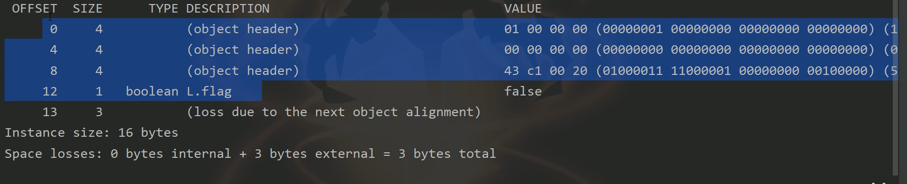
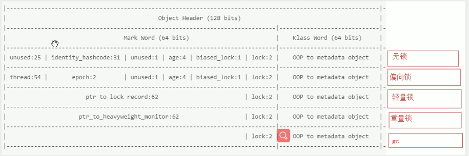

## java对象布局

java对象在堆上，大小不固定

在堆上为java对象开辟多大的内存空间？

取决于：

1.java对象的实例变量）--->大小不固定

2.对象头--->大小固定

3.数据对齐

​	64位的JVM (64bit 的java虚拟机) 分配内存时必须是	8的整数倍字节（byte）


**synchronized上锁就是改变对象的对象头**

`ClassLayout.parseInstance(实例对象).toPrintable()`可以查看该实例对象的对象布局



## java对象头由什么组成

JVM	:	规范/标准，其中规定了对象头由什么组成

Hotpot	:	产品/实现，大部分代码使用的都是openjdk，部分代码商用不开源

openjdk	:	代码（C++/开源）

对象头大小：96 bit / 12 byte

1. Mark Word (64 bit/ 8 byte)

   根据对象的状态（下部分）不同，内容不同

2. klass pointer/Class Metadata Address (32 bit/ 4 byte)

   使用的java虚拟机如果开启**指针压缩**，那么klass pointer就是**32bit**,如果没有，则klass pointer为**64bit**

## 使用synchronized关键字时锁对象有哪些状态？

`synchronized(l){....}`

对象`l`的状态有5种：

1. 无状态

   刚 new 出来的对象

2. 偏向锁

3. 轻量锁

4. 重量锁（synchronized加的就是重量锁）

5. gc标记

   例子：

   ```java
   public void function_1(){
   
   ​	A a = new A();
   
   .......
   
   }
   ```

   a为堆中的对象的引用

   当方法运行完后，对象的引用结束，方法的实例对象会被gc标记，证明该对象将要被回收

   

   **对象头：**

   128bit 或 96bit ，取决于虚拟机是否指针压缩



lock 为 2 位，怎么能表示上述5种状态？

加了 1 位 biased_lock 位，偏向锁状态和无锁状态的 lock 2位表示是一样的，通过 biased_lock 位区分，后面三种状态无需biased_lock 位

Intel架构采用小端存储，低地址存在高位，高地址存在低位，因此对应查看输出的对象布局时，应该倒着对应。hashcode本身不存在，因此该31位都是0，如果调用`l.hashcode()`方法计算过hashcode后，该对应位就会有值
